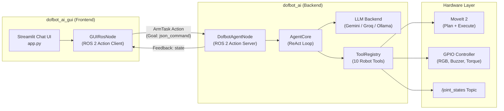
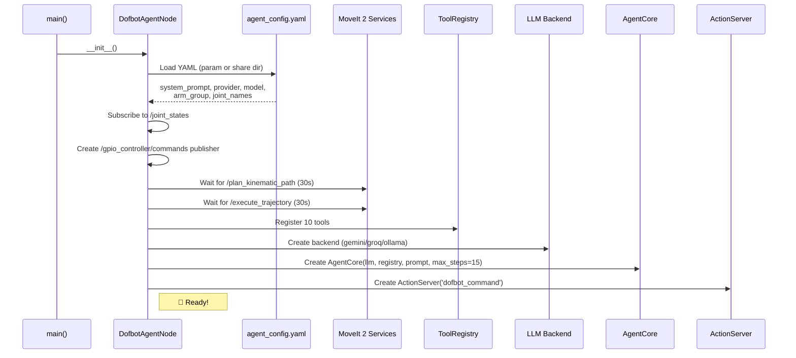
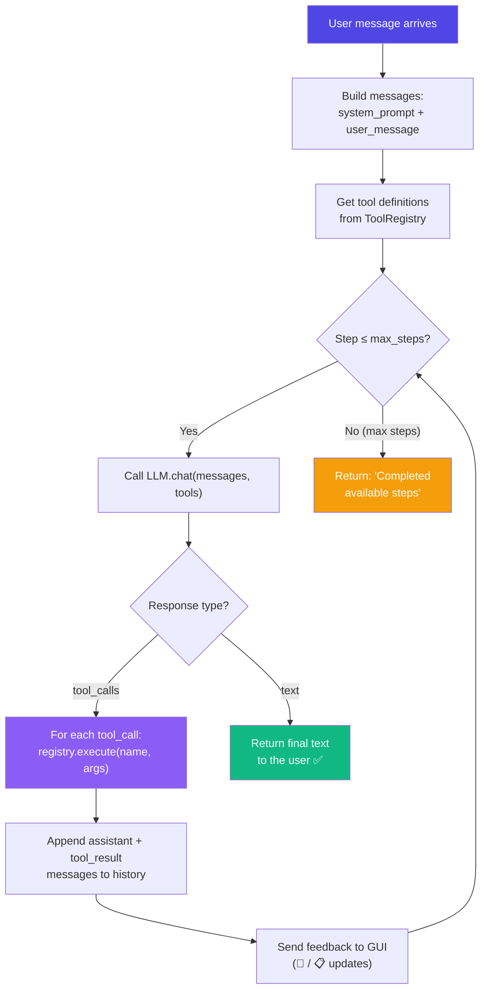
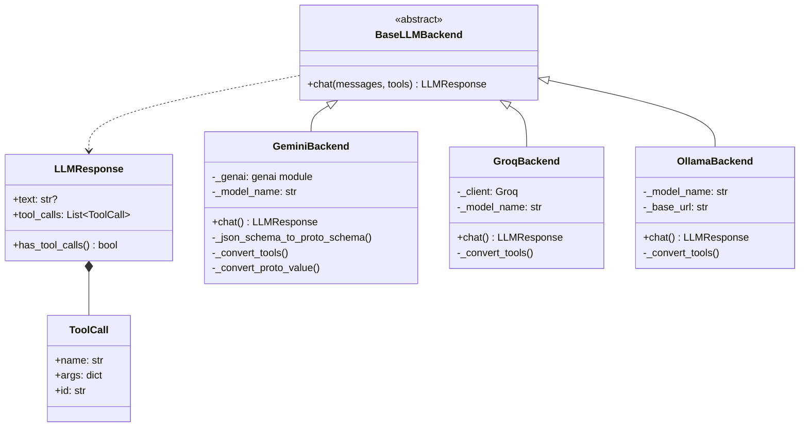
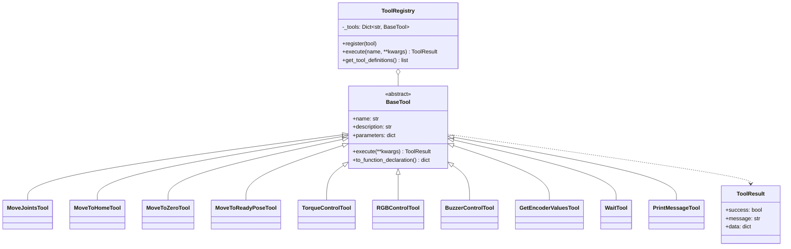
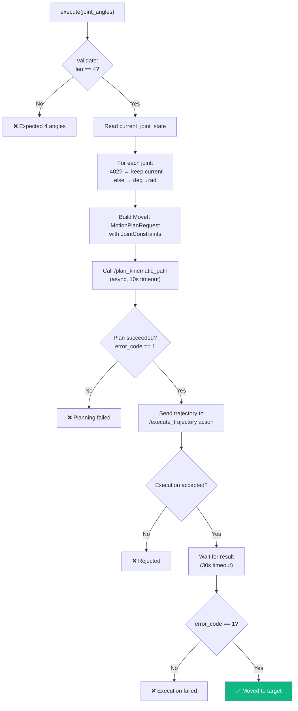
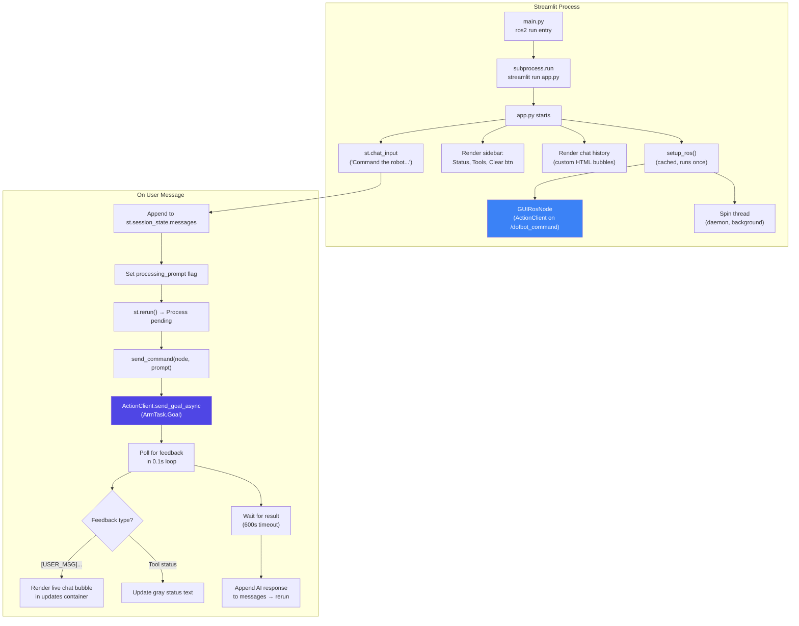
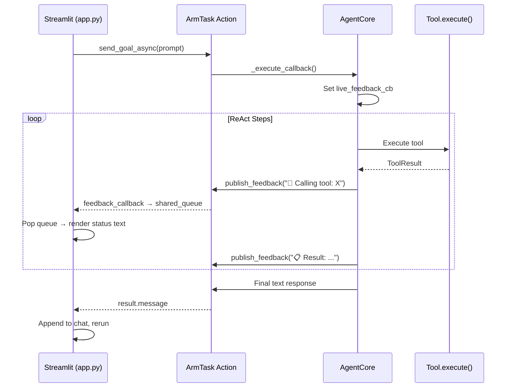
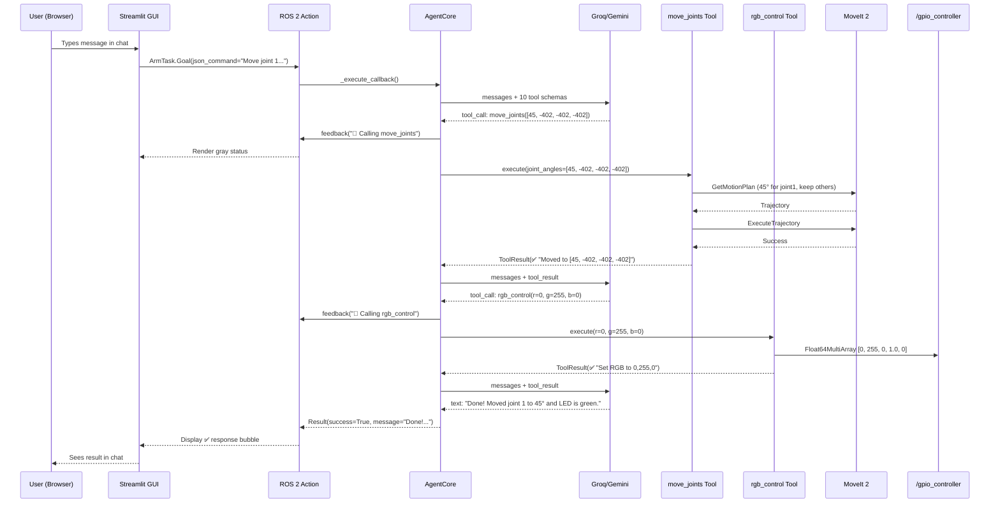

# Dofbot AI System — Complete Architectural Analysis

## System Overview

The Dofbot AI system is a **natural-language-controlled robotic arm** built on two ROS 2 packages that together form an **LLM-powered ReAct (Reasoning + Acting) agent**. A user types a command in a chat UI → an LLM decides which robot tools to call → tools execute real MoveIt motions and GPIO commands on the physical 4-DOF Yahboom Dofbot arm.



---

## Package 1: `dofbot_ai` — The Agent Backend

### File Structure

| File | Purpose |
|------|---------|
| [agent_node.py](file:///home/roboholic_harsh/Desktop/dofbotarm/harsh_ws/src/dofbot_ai/dofbot_ai/agent_node.py) | ROS 2 node: Action Server + wiring everything together |
| [agent_core.py](file:///home/roboholic_harsh/Desktop/dofbotarm/harsh_ws/src/dofbot_ai/dofbot_ai/agent_core.py) | ReAct loop engine (LLM ↔ Tool execution cycle) |
| [agent_config.yaml](file:///home/roboholic_harsh/Desktop/dofbotarm/harsh_ws/src/dofbot_ai/config/agent_config.yaml) | System prompt, provider, model, joint names |
| [base_backend.py](file:///home/roboholic_harsh/Desktop/dofbotarm/harsh_ws/src/dofbot_ai/dofbot_ai/llm_backends/base_backend.py) | Abstract LLM interface (`BaseLLMBackend`, `LLMResponse`, `ToolCall`) |
| [gemini_backend.py](file:///home/roboholic_harsh/Desktop/dofbotarm/harsh_ws/src/dofbot_ai/dofbot_ai/llm_backends/gemini_backend.py) | Google Gemini backend (native function calling) |
| [groq_backend.py](file:///home/roboholic_harsh/Desktop/dofbotarm/harsh_ws/src/dofbot_ai/dofbot_ai/llm_backends/groq_backend.py) | Groq backend (OpenAI-compatible API) |
| [ollama_backend.py](file:///home/roboholic_harsh/Desktop/dofbotarm/harsh_ws/src/dofbot_ai/dofbot_ai/llm_backends/ollama_backend.py) | Ollama local backend (HTTP `/api/chat`) |
| [base_tool.py](file:///home/roboholic_harsh/Desktop/dofbotarm/harsh_ws/src/dofbot_ai/dofbot_ai/tools/base_tool.py) | Abstract tool class + `ToolResult` dataclass |
| [registry.py](file:///home/roboholic_harsh/Desktop/dofbotarm/harsh_ws/src/dofbot_ai/dofbot_ai/tools/registry.py) | Central tool registration + execution + schema generation |
| [move_joints.py](file:///home/roboholic_harsh/Desktop/dofbotarm/harsh_ws/src/dofbot_ai/dofbot_ai/tools/move_joints.py) | **Core motion tool** — MoveIt plan + execute |
| [move_to_home.py](file:///home/roboholic_harsh/Desktop/dofbotarm/harsh_ws/src/dofbot_ai/dofbot_ai/tools/move_to_home.py) | Preset: `[0, 90, -90, -90]` degrees |
| [move_to_zero.py](file:///home/roboholic_harsh/Desktop/dofbotarm/harsh_ws/src/dofbot_ai/dofbot_ai/tools/move_to_zero.py) | Preset: `[0, 0, 0, 0]` degrees |
| [move_to_ready_pose.py](file:///home/roboholic_harsh/Desktop/dofbotarm/harsh_ws/src/dofbot_ai/dofbot_ai/tools/move_to_ready_pose.py) | Preset: `[0, 45, -90, -45]` degrees |
| [torque_control.py](file:///home/roboholic_harsh/Desktop/dofbotarm/harsh_ws/src/dofbot_ai/dofbot_ai/tools/torque_control.py) | Enable/disable motor torque via GPIO |
| [rgb_control.py](file:///home/roboholic_harsh/Desktop/dofbotarm/harsh_ws/src/dofbot_ai/dofbot_ai/tools/rgb_control.py) | Set RGB LED color via GPIO |
| [buzzer_control.py](file:///home/roboholic_harsh/Desktop/dofbotarm/harsh_ws/src/dofbot_ai/dofbot_ai/tools/buzzer_control.py) | Toggle buzzer via GPIO |
| [get_encoder_values.py](file:///home/roboholic_harsh/Desktop/dofbotarm/harsh_ws/src/dofbot_ai/dofbot_ai/tools/get_encoder_values.py) | Read current joint positions from `/joint_states` |
| [wait.py](file:///home/roboholic_harsh/Desktop/dofbotarm/harsh_ws/src/dofbot_ai/dofbot_ai/tools/wait.py) | `time.sleep()` with 0–300s safety cap |
| [print_message.py](file:///home/roboholic_harsh/Desktop/dofbotarm/harsh_ws/src/dofbot_ai/dofbot_ai/tools/print_message.py) | Send a `[USER_MSG]` to the GUI via feedback callback |

---

### 1. Node Initialization Flow (`DofbotAgentNode.__init__`)



**Key details:**
- Config is loaded from a ROS param `config_file` or falls back to the installed share directory
- ROS params `provider`, `model`, `api_key` can override YAML defaults
- Defaults: **Groq** provider with `qwen/qwen3-32b` model, **15 max ReAct steps**
- Robot config: `dofbot_arm` planning group, 4 joints (`arm1_Joint` through `arm4_Joint`)

---

### 2. The ReAct Loop (`AgentCore.run`)

This is the **brain** of the system. It implements a classic ReAct (Reason + Act) pattern:



**Step-by-step:**
1. Build the message array: `[system_prompt, user_message]`
2. Collect JSON schemas of all 10 tools from `ToolRegistry.get_tool_definitions()`
3. Loop (up to 15 iterations):
   - Send messages + tool schemas to LLM → get `LLMResponse`
   - If response contains `tool_calls` → execute each tool → append results to message history → loop back
   - If response contains `text` → done, return text to user
4. If 15 steps exhausted → return a fallback message

---

### 3. LLM Backend Abstraction

All three backends implement the same interface:



| Backend | SDK/Protocol | Tool Schema Format | API Key Env Var |
|---------|-------------|-------------------|-----------------|
| **Gemini** | `google-generativeai` | Protobuf `FunctionDeclaration` | `GEMINI_API_KEY` |
| **Groq** | `groq` Python SDK | OpenAI-compatible `tools[]` | `GROQ_API_KEY` |
| **Ollama** | HTTP `requests` to `/api/chat` | OpenAI-compatible `tools[]` | None (local) |

> [!NOTE]
> Each backend handles its own message format conversion internally (e.g., Gemini uses `role: "model"` and `role: "function"`, Groq uses `role: "tool"` with `tool_call_id`).

---

### 4. Tool System Architecture



#### Tool Categories

**Motion Tools** (use MoveIt 2):
| Tool | Parameters | What It Does |
|------|-----------|--------------|
| `move_joints` | `joint_angles: [4 floats]` | Plans via `/plan_kinematic_path` → executes via `/execute_trajectory`. `-402` = keep joint unchanged |
| `move_to_home` | None | Delegates to `move_joints([0, 90, -90, -90])` |
| `move_to_zero` | None | Delegates to `move_joints([0, 0, 0, 0])` |
| `move_to_ready_pose` | None | Delegates to `move_joints([0, 45, -90, -45])` |

**GPIO Tools** (publish to `/gpio_controller/commands`):
| Tool | Parameters | GPIO Array Position |
|------|-----------|-------------------|
| `rgb_control` | `r, g, b: int (0-255)` | `[R, G, B, -, -]` |
| `torque_control` | `enable: bool` | `[-, -, -, torque, -]` |
| `buzzer_control` | `state: bool` | `[-, -, -, -, buzzer]` |

The GPIO command is a `Float64MultiArray` with layout: `[led_r, led_g, led_b, torque_enable, buzzer_trigger]`

**Sensor/Utility Tools:**
| Tool | What It Does |
|------|-------------|
| `get_encoder_values` | Reads `/joint_states` subscription, returns current positions as a dict |
| `wait` | `time.sleep(seconds)`, capped at 300s |
| `print_message` | Sends `[USER_MSG]<text>` via the feedback callback to the GUI |

#### MoveJoints Deep Dive (the core motion tool)



---

## Package 2: `dofbot_ai_gui` — The Streamlit Frontend

### File Structure

| File | Purpose |
|------|---------|
| [main.py](file:///home/roboholic_harsh/Desktop/dofbotarm/harsh_ws/src/dofbot_ai_gui/dofbot_ai_gui/main.py) | ROS 2 entry point: finds `app.py` in share dir, runs `streamlit run` |
| [app.py](file:///home/roboholic_harsh/Desktop/dofbotarm/harsh_ws/src/dofbot_ai_gui/dofbot_ai_gui/app.py) | Full Streamlit application (UI + ROS 2 action client) |

### GUI Architecture



### UI Design

The GUI uses a **premium dark-mode glassmorphism design** with:
- **Custom CSS**: Dark `#0a0a0f` background with purple/indigo radial gradients
- **Outfit font** from Google Fonts
- **Custom chat bubbles**: User messages in purple gradient (right-aligned), AI messages in frosted glass (left-aligned)
- **Animated entry**: `fadeIn` CSS animation on new messages
- **Sidebar**: ROS 2 connection status indicator, tool badge grid, suggestion prompts
- **Live feedback**: Tool calls shown as gray italic text during execution; `[USER_MSG]` feedback rendered as distinct blue-bordered bubbles

### Feedback Pipeline



---

## Custom Interface: `ArmTask.action`

Defined in [ArmTask.action](file:///home/roboholic_harsh/Desktop/dofbotarm/harsh_ws/src/dofbot_custom_interfaces/action/ArmTask.action):

```
# Goal
string json_command        ← Natural language command from user

---
# Result
bool success               ← True if agent completed successfully
string message             ← Final LLM text response

---
# Feedback
string state               ← Live tool call updates / [USER_MSG] bubbles
```

---

## End-to-End Flow: "Move joint 1 to 45 degrees and turn the LED green"



---

## Launch System

[ai_bringup.launch.py](file:///home/roboholic_harsh/Desktop/dofbotarm/harsh_ws/src/dofbot_urdf/launch/ai_bringup.launch.py) orchestrates everything:

```
ros2 launch dofbot_urdf ai_bringup.launch.py
```

1. **Includes** `dofbot_moveit/robot_bringup.launch.py` — starts hardware drivers, controllers, MoveIt
2. **Launches** `dofbot_ai/agent_node` — the ReAct agent with action server
3. **Launches** `dofbot_ai_gui/main` — Streamlit subprocess on browser

---

## ROS 2 Topic/Service/Action Map

| Interface | Type | Direction | Used By |
|-----------|------|-----------|---------|
| `/dofbot_command` | ArmTask Action | GUI → Agent | Communication bridge |
| `/joint_states` | JointState Topic | Hardware → Agent | `get_encoder_values`, `move_joints` |
| `/gpio_controller/commands` | Float64MultiArray Topic | Agent → Hardware | `rgb_control`, `buzzer_control`, `torque_control` |
| `/plan_kinematic_path` | GetMotionPlan Service | Agent → MoveIt | `move_joints` |
| `/execute_trajectory` | ExecuteTrajectory Action | Agent → MoveIt | `move_joints` |

---

## Key Design Patterns

1. **ReAct Agent Pattern**: The LLM reasons step-by-step, calling tools iteratively until it has enough information to produce a final answer. This allows multi-step task execution from a single natural language command.

2. **Strategy Pattern for LLM Backends**: All three providers (Gemini, Groq, Ollama) implement `BaseLLMBackend.chat()`, making the provider hot-swappable via a single config param.

3. **Decorator/Delegate Pattern for Preset Poses**: `MoveToHomeTool`, `MoveToZeroTool`, `MoveToReadyPoseTool` all delegate to `MoveJointsTool.execute()` — they're thin wrappers with hardcoded angles.

4. **GPIO Multiplexing**: All GPIO peripherals (RGB, torque, buzzer) share a single `Float64MultiArray` publisher. Each tool modifies its own fields on the node and calls `publish_gpio_command()`.

5. **Live Feedback via Action Protocol**: The `ArmTask` action's `Feedback.state` field carries real-time tool execution updates from the agent to the GUI, enabling a responsive chat experience.
